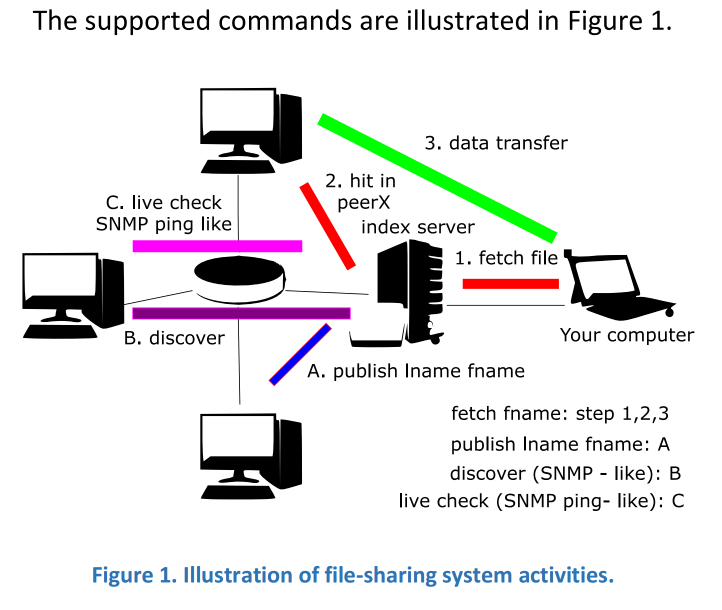

> _Build a simple file-sharing application with application protocols defined by each group, using the TCP/IP protocol stack._

- A centralized server **keeps track of which clients are connected** and **storing what files**.
- A client informs the server as to what files are contained in its local repository but does not actually transmit file data to the server.
- When a client requires a file that does not belong to its repository, a request is sent to the server.
  - The server identifies some other clients who store the requested file and sends their identities to the requesting client.
  - The client will select a source node.
  - The file is directly fetched by the client from the node that has the copy of the file without any server intervention.
- Many clients could be downloading different files from a target client at a given point in time. This requires the client code to be multithreaded.
- The client has a simple command-shell interpreter that accepts 2 kinds of command:

| Command               | Definition                                                                                                                                                           |
| --------------------- | -------------------------------------------------------------------------------------------------------------------------------------------------------------------- |
| `publish lname fname` | a local file (which is stored in the client’s file system as lname) is added to the client’s repository as a file named fname, which is then conveyed to the server. |
| `fetch fname`         | fetch some copy of the target file and add it to the local repository.                                                                                               |

- The server has a simple command-line interpreter

| Command             | Definition                                              |
| ------------------- | ------------------------------------------------------- |
| `discover hostname` | discover the list of local files of host named hostname |
| `ping hostname`     | live check the host named hostname                      |



- It is important to note that the connecting infrastructure is not implied by the representation in Figure 1. All devices are interconnected through the Internet. Separating them is the logical point of view regarding the protocol’s activities.

## Setup instructions

1. **Create a virtual environment** (optional, but recommended)

```sh
python3 -m venv venv
```

2. **Activate the virtual environment** (optional, but recommended)

Windows:

```sh
venv\Scripts\activate.bat
```

On Linux or macOS:

```sh
source venv/bin/activate
```

3. **Install the dependencies**

```sh
pip install -r requirements.txt
```

4. **Install tkinter**

Windows:

```sh
python -m pip install tk
```

On Linux or macOS:

```sh
sudo apt-get install python3-tk
```

## Usage

**Run the server**

```sh
python server.py
```

**Run the client**

```sh
python client.py
```

**Run the GUI**

```sh
python gui.py
```
